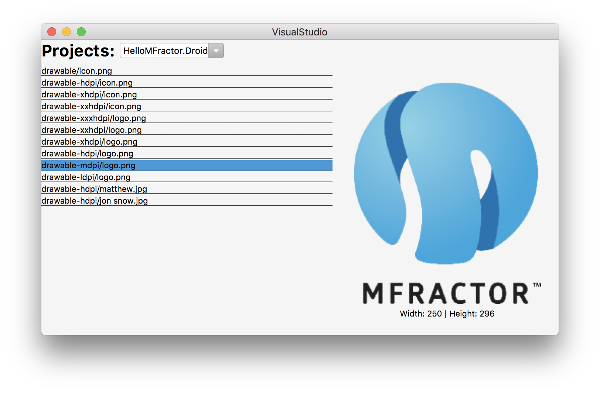

# Xamarin.Forms In Visual Studio Mac

*Learn to use Xamarin.Forms to build user interfaces for your Visual Studio Mac extensions.*

## Introduction

Ever since I commercialised MFractor in June 2017, I've been pulled to the idea of using XAML and Xamarin.Forms to build user interfaces for Visual Studio Mac extensions.

For MFractor, developing tools like the Image Wizard or localisation wizard cost days to weeks of engineering effort. This time-cost makes it prohibitively expensive to develop tools that are UI-centric.

Therefore, there are compelling reasons to use Xamarin.Forms to build Visual Studio Mac extensions:

 * XAML is much, much easier to work with than XWT, Visual Studio Macs UI framework. This dramatically lowers the barrier to entry for developing Visual Studio Mac extensions.
 * We can use data-binding to save a lot of "glue" code and can also make use of value converters, triggers and behaviours.
 * With a Xamarin.Forms WPF backend available, user interfaces are reusable in both Visual Studio Mac **and** Visual Studio Windows.
 * By using XAML to build MFractors UIs, I can use MFractor to build itself; an awesome process of dogfooding to accelerate product development.

There are huge productivity gains here!

To prove that this technique is valid for production-ready tooling and is not just a toy, we'll be building an image asset browser you can use to visually explore images inside a solution:




So, read on to learn how to use Xamarin.Forms inside Visual Studio Mac to build rich user interfaces for your tooling.

## Using Xamarin.Forms Inside Visual Studio Mac

Let's get started!

First things first, you **must** have version 1.4.2 of the Addin Maker installed into Visual Studio Mac. Based on my many, many failed attempts at getting this to work, AddinMaker v1.4.2 is the one that works.

Next, you'll need to create a new Visual Studio Mac extension that is an SDK style project and references the NuGet MonoDevelop.Addins v0.4.4. I've found that the Xamarin.Forms bootstrapping process does not work in Visual Studio Mac extensions that are not SDK style projects.

If you have an existing extension, you'll need to upgrade your main extensions project to an SDK style project and reference NuGet MonoDevelop.Addins v0.4.4. I've found the best way to do this is to create a new extension project within


 * Add Xamarin.Forms and Xamarin.Forms.Platform.GTK nugets to the project.

 Next, we need to add Xamarin.Forms into our project.

 Add the following  packages into your Visual Studio Mac extension:
  * Xamarin.Forms.Platform.GTK.

 * Initialise Xamarin.Forms, create a startup command to do so.

Before we can build any UIs  Now we need to startup Xamarin.Forms


**InitXamarinFormsCommand.cs**
```
public class InitXamarinFormsCommand : CommandHandler
{
	protected override void Run()
	{
        Forms.Init();
        Console.WriteLine("Xamarin.Forms has been initialised");
	}
}
```

And then in our `Manifest.addin.xml` we insert our `InitXamarinFormsCommand` into the `/MonoDevelop/Ide/StartupHandlers` extension point:

**Manifest.addin.xml**
```
<Extension path="/MonoDevelop/Ide/StartupHandlers">
    <Class class="XamarinFormsUIs.Commands.InitXamarinFormsCommand"/>
</Extension>
```

When the IDE opens, the `Run()` method of `InitXamarinFormsCommand` will be invoked.

In future, Microsoft and the Visual Studio Mac team will need

 * Create our Xamarin.Forms user interface.

 * [ImageAssetBrowserView.xaml](src/XamarinFormsUIs/Views/ImageAssetBrowserView.xaml): Our XAML view
 * [ImageAssetBrowserViewModel.cs](src/XamarinFormsUIs/ViewModels/ImageAssetBrowserViewModel.cs):

Let's quickly run through what we have here:

 *  


 * Use native embedding to inject the view and viewmodel into a GTK dialog.

**ImageAssetBrowserWindow.cs&**
```
public class ImageAssetsWindow : Gtk.Window
{
    public ImageAssetsWindow()
        : base(Gtk.WindowType.Toplevel)
    {
        var page = new ImageAssetBrowserView();

        page.BindingContext = new ImageAssetBrowserViewModel(MonoDevelop.Ide.TypeSystem.TypeSystemService.Workspace.CurrentSolution);

        this.Add(page.CreateContainer());
        SetDefaultSize((int)page.WidthRequest, (int)page.HeightRequest);
        SetSizeRequest((int)page.WidthRequest, (int)page.HeightRequest);
    }
}
```

This creates a reusable window


 * Show our UI using a command handler in the tools menu.

Lastly, we create a `CommandHandler` to show our user interface:

**BrowseImageAssetsCommand.cs**
```
public class BrowseImageAssetsCommand : CommandHandler
{
	protected override void Update(CommandInfo info)
	{
        info.Enabled = true;
        info.Visible = true;
	}

    protected override void Run()
    {
        new ImageAssetsWindow().Show();
    }
}
```

And then we expose the `BrowseImageAssetsCommand` through the tools menu:

**Manifest.addin.xml**
```
<Extension path="/MonoDevelop/Ide/Commands">
    <Command _label="Browse Image Assets"
             id="XamarinFormsUIs.Commands.BrowseImageAssetsCommand"
             description="Allows you to visually explore the image assets in your solution."
             defaultHandler="XamarinFormsUIs.Commands.BrowseImageAssetsCommand"/>
</Extension>

<Extension path = "/MonoDevelop/Ide/MainMenu/Tools">
    <CommandItem id="XamarinFormsUIs.Commands.BrowseImageAssetsCommand"/>
</Extension>
```


## Summary


 * We need to make an official Visual Studio Mac Xamarin.Forms extension to prevent multiple calls to Forms.Init() and potential assembly version conflicts.
 * My

https://upload.wikimedia.org/wikipedia/commons/thumb/0/04/Barack_Obama_Mic_Drop_2016.jpg/440px-Barack_Obama_Mic_Drop_2016.jpg
